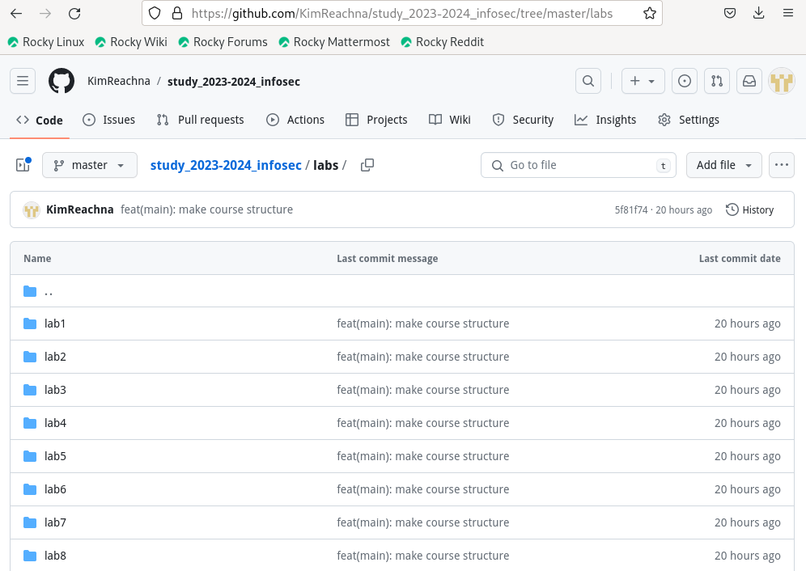

---
## Front matter
title: "Отчет по лабораторной работе №1"
subtitle: "Развертывание виртуальной машины"
author: "Ким Реачна"

## Generic otions
lang: ru-RU
toc-title: "Содержание"

## Bibliography
bibliography: bib/cite.bib
csl: pandoc/csl/gost-r-7-0-5-2008-numeric.csl

## Pdf output format
toc: true # Table of contents
toc-depth: 2
lof: true # List of figures
lot: true # List of tables
fontsize: 12pt
linestretch: 1.5
papersize: a4
documentclass: scrreprt
## I18n polyglossia
polyglossia-lang:
  name: russian
  options:
	- spelling=modern
	- babelshorthands=true
polyglossia-otherlangs:
  name: english
## I18n babel
babel-lang: russian
babel-otherlangs: english
## Fonts
mainfont: PT Serif
romanfont: PT Serif
sansfont: PT Sans
monofont: PT Mono
mainfontoptions: Ligatures=TeX
romanfontoptions: Ligatures=TeX
sansfontoptions: Ligatures=TeX,Scale=MatchLowercase
monofontoptions: Scale=MatchLowercase,Scale=0.9
## Biblatex
biblatex: true
biblio-style: "gost-numeric"
biblatexoptions:
  - parentracker=true
  - backend=biber
  - hyperref=auto
  - language=auto
  - autolang=other*
  - citestyle=gost-numeric
## Pandoc-crossref LaTeX customization
figureTitle: "Рис."
tableTitle: "Таблица"
listingTitle: "Листинг"
lofTitle: "Список иллюстраций"
lotTitle: "Список таблиц"
lolTitle: "Листинги"
## Misc options
indent: true
header-includes:
  - \usepackage{indentfirst}
  - \usepackage{float} # keep figures where there are in the text
  - \floatplacement{figure}{H} # keep figures where there are in the text
---

# Цель работы

Целью данной работы является приобретение практических навыков установки операционной системы на виртуальную машину, размещение файлов на сервисе Git и подготовка отчета в формате Markdown.

# Выполнение лабораторной работы

Создаю виртуальную машину

{ #fig:001 width=70% height=70% }

Указание размера основной памяти виртуальной машины - 2048 МБ

Задаю конфигурацию жёсткого диска — VDI, динамический виртуальный диск.

{ #fig:002 width=70% height=70% }

{ #fig:003 width=70% height=70% }

{ #fig:004 width=70% height=70% }

Добавляю новый привод оптических дисков и выбираю образ 

{ #fig:005 width=70% height=70% }

Запускаю виртуальную машину и выбираю установку системы на жёсткий диск.

Устанавливаю язык для интерфейса и раскладки клавиатуры

{ #fig:006 width=70% height=70% }

Указываю параметры установки

{ #fig:007 width=70% height=70% }

 
Перехожу к этапу установки и дожидаюсь его завершения.

{ #fig:008 width=70% height=70% }

{ #fig:009 width=70% height=70% }

Загружаю с жесткого диска установленную систему

{ #fig:010 width=70% height=70% }

Перехожу к созданию репозитория. Для этого задаем параметры пользователя гит, копируем шаблон курса и создаем на его основе репозиторий.

{ #fig:011 width=70% height=70% }

{ #fig:012 width=70% height=70% }

Проверила, что файлы успешно загружены на репозиторий

{ #fig:012 width=70% height=70% }

Написала отчет по выполненной работе на Markdown

{ #fig:012 width=70% height=70% }

# Вывод

Мы приобрели практические навыки установки операционной системы на виртуальную машину, Целью данной работы является приобретение практических навыков установки операционной системы на виртуальную машину, разместили файлы работы на сервисе Git и подготовили отчет в формате Markdown.